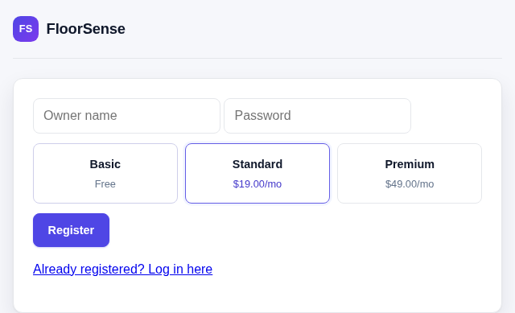
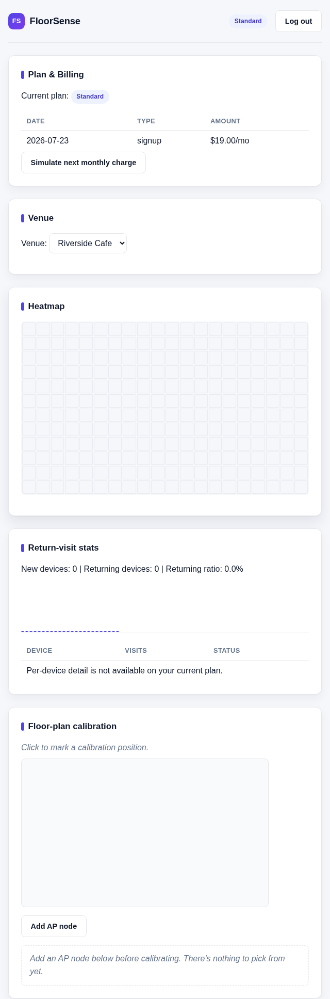
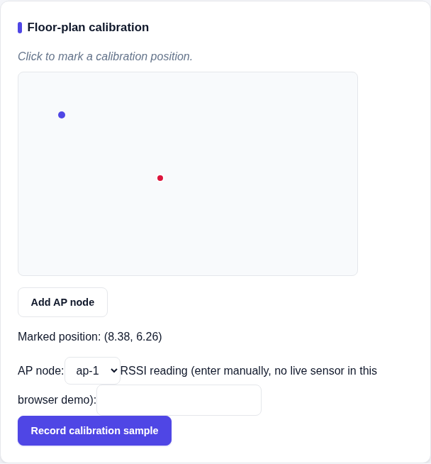

# FloorSense

Consent-based WiFi presence analytics for restaurants, cafes, and retail
floors. A visitor joins the venue's open WiFi and accepts a consent splash
page before anything about their device is tracked. From there the system
builds seating heatmaps, dwell-time stats, and return-visit tracking for
the business owner, all keyed off a salted hash of the device, never a raw
MAC address.

This is a local-first proof of concept: everything below runs on your own
laptop, no real access point or router hardware needed.

## Screenshots

Registering picks a plan and simulates the signup payment immediately:



The dashboard shows the plan, billing history, venues, heatmap, and
return-visit stats:



Adding an AP node and marking a calibration position on the floor plan:



## Requirements

- Node.js 26.4.0 or newer (this repo relies on the built-in `node:sqlite`
  module and Node's native TypeScript execution, no build step, no
  `ts-node`).

## Quick start

```bash
npm install
npm test
```

That installs all 6 workspace packages and runs the full test suite
(around 240 tests).

### Try the owner dashboard

Start the owner-facing web app:

```bash
node --input-type=module -e "
import { openDatabase } from '@floorsense/backend';
import { createOwnerPortalServer } from '@floorsense/owner-portal';
const db = openDatabase();
createOwnerPortalServer(db).listen(3000, () => console.log('Open http://localhost:3000'));
"
```

Then open **http://localhost:3000**, click "Register", pick a plan
(Basic, Standard, or Premium - prices are simulated, no real card
details are collected), and create an account. Registration simulates
the signup payment immediately and drops you straight into the
dashboard, which has a "Plan & Billing" section showing your plan and
a button to simulate the next monthly charge. Add your first venue from
the empty-state form. This is real data: the SQLite file is created at
`packages/backend/data/floorsense.sqlite` and persists across restarts.

Registering with the name **Wali** always grants full Premium access
regardless of the plan picked at signup - a temporary test override for
the project owner, meant to be removed later, not a real feature.

### See it working end to end with simulated data

The dashboard starts empty since nothing has walked through the
consent flow yet. To see the whole pipeline (simulated devices,
positioning, heatmap, tiers) working against synthetic data, run any of
the demo scripts:

```bash
node packages/owner-portal/src/heatmapDemo.ts        # simulated visits -> a real heatmap
node packages/owner-portal/src/onboardingDemo.ts     # register -> create venue -> reach the API
node packages/owner-portal/src/apNodeCreationDemo.ts # add an AP node -> calibrate against it
node packages/owner-portal/src/billingDemo.ts         # tier purchase, Wali override, monthly billing
node packages/captive-portal/src/demo.ts              # a device joining through the consent portal
```

Every package's `src/` directory has a few of these runnable scripts (any
file with a `node src/xyz.ts` comment at the bottom). They print their
results to the console and don't require a browser.

## Project layout

npm workspaces, one package per concern:

- `packages/shared`: shared types and the device-hashing utility.
- `packages/ap-adapter-sim`: simulates a WiFi access point's presence
  events for local development.
- `packages/positioning`: RSSI-to-position math (trilateration).
- `packages/backend`: SQLite persistence, multi-tenant data model,
  calibration, sessions, heatmap, tiers.
- `packages/captive-portal`: the device-facing consent splash page.
- `packages/owner-portal`: the owner-facing login, dashboard, and API.

See `docs/architecture.md` for the invariants this system is built
around and the reasoning behind the tech choices, and
`docs/positioning-accuracy.md` for what accuracy to realistically
expect from the calibration and trilateration math.

## Real-hardware deployment

`deploy/captive-portal/` has hostapd/dnsmasq/nftables config templates
for running this on real access-point hardware later. They're templates
and docs only, nothing in this repo runs them automatically.

Real AP nodes (including ESP32 units) report presence events to
`POST /hardware/events`, authenticated by the venue's own
`hardwareToken` (visible via `GET /venues` once logged in as that
venue's owner) - see `docs/architecture.md`'s "Real hardware
ingestion" section for the exact contract.

### Testing with a real ESP32

Full sequence, start to finish - `firmware/esp32-ap-node/README.md`
has the same steps with more detail on the firmware side:

1. Start the owner-portal server (the "Try the owner dashboard"
   command above), reachable at your machine's LAN IP, not just
   `localhost` - e.g. `http://192.168.4.2:3000`.
2. On the dashboard: register, pick a plan, create a venue, and add an
   AP node (its `apNodeId` is whatever you type into "Add AP node").
3. Note the venue's `id` and `hardwareToken` - both are in the
   response from `GET /venues` (open your browser's dev tools Network
   tab while the dashboard loads, or `curl` it with your session
   token).
4. Start a REAL (not demo) captive-portal server for that specific
   venue, sharing the same persistent database:
   ```bash
   node packages/captive-portal/src/startRealServer.ts <venueId>
   ```
   This listens on port 3001 by default (override with a third
   argument) and exits with a clear error if `<venueId>` doesn't
   exist - it won't silently start misconfigured.
5. Edit `firmware/esp32-ap-node/esp32_ap_node.ino`'s config block:
   `BACKEND_URL` = step 1's address, `CONSENT_PORTAL_URL` = step 4's
   address, `VENUE_ID`/`HARDWARE_TOKEN` = step 3's values,
   `AP_NODE_ID` = step 2's AP node.
6. Flash the ESP32, join its WiFi network from a phone, accept
   consent, and watch the dashboard's heatmap/stats for that venue.
